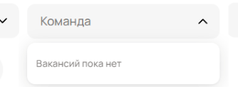
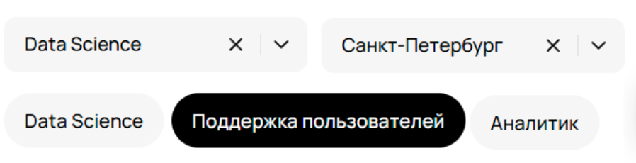
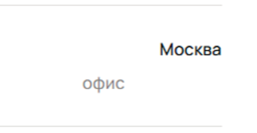

# Bug 1
| ID | Описание | Приоритет |  Объяснение | Ожидаемый результат | Фактический результат | 
| :--: | :-- | :-- | :-- | :--: | :--: |
| **1.1** | **Иконка очистки не отображается на странице вакансий** |  Low  | Отсутствие иконки не нарушает основную функцию сайта    | Иконка отображается | Иконка не отображается |

# Bug 2
| ID | Описание | Приоритет |  Объяснение | Ожидаемый результат | Фактический результат | 
| :--: | :-- | :-- | :-- | :--: | :--: |
| **1.2** | **Отображается текст "Вакансий пока нет" в выпадающем списке Команды** |  Low  | Опечатка не влияет на основную функциональность сайта    | Текст "Команд пока нет" | Текст "Вакансий пока нет" |

# Bug 3
| ID | Описание | Приоритет |  Объяснение | Ожидаемый результат | Фактический результат | 
| :--: | :-- | :-- | :-- | :--: | :--: |
| **1.3** | **В строке с названием города отображается формат работы** |  Medium | Баг не мешает использовать сайт, но ухудшает опыт использования    | В строке с названием города не отображается формат работы  |  В строке с названием города отображается формат работы|

# Bug 4
| ID | Описание | Приоритет |  Объяснение | Ожидаемый результат | Фактический результат | 
| :--: | :-- | :-- | :-- | :--: | :--: |
| **1.4** | **При выборе направления Data Science доступна категория "Поддержка пользователей"** |  High | Нарушение параметров фильтра мешает поиску нужных вакансий    | При выборе направления не отображается категория "Поддержка пользователей"  |  При выборе направления отображается категория "Поддержка пользователей" |

# Bug 5
| ID | Описание | Приоритет |  Объяснение | Ожидаемый результат | Фактический результат | 
| :--: | :-- | :-- | :-- | :--: | :--: |
| **1.5** | **Количество отображаемых вакансий не совпадает со значением счётчика** |  Medium  | Неверный подсчёт вакансий может ухудшить пользовательский опыт    | Количество вакансий соответствует отображению в счётчике   |   Количество вакансий не соответствует отображению в счётчике  |

# Bug 6
| ID | Описание | Приоритет |  Объяснение | Ожидаемый результат | Фактический результат | 
| :--: | :-- | :-- | :-- | :--: | :--: |
| **1.6** | **Отображается сообщение "Ничего не нашлось" при отображении списка вакансий** |  Medium  | Баг не мешает пользоваться продуктом, но может ввести в заблуждение пользователя, что поиск сломан     | Сообщение "Ничего не нашлось" отображается при отсутсвии вакансий по выбранным параметрам |  Сообщение "Ничего не нашлось" отображается при отображении списка вакансий |

# Bug 7
| ID | Описание | Приоритет |  Объяснение | Ожидаемый результат | Фактический результат | 
| :--: | :-- | :-- | :-- | :--: | :--: |
| **1.7** | **Карточка вакансии: Метка "Офис" смещена и не находится под названием города "Москва"** |  Low  | Косметический дефект не влияющий на основную работу сайта    | Метка "Офис" находится под названием города |  Метка "Офис" смещена |

# Bug 8
| ID | Описание | Приоритет |  Объяснение | Ожидаемый результат | Фактический результат | 
| :--: | :-- | :-- | :-- | :--: | :--: |
| **1.8** | **Кнопка "Про направления" отображается без стрелки** |  Low  | Косметический дефект не влияющий на основную работу сайта    | Кнопка "Про направления" отображается со стрелкой |  Кнопка "Про направления" отображается без стрелки |

# Bug 9
| ID | Описание | Приоритет |  Объяснение | Ожидаемый результат | Фактический результат | 
| :--: | :-- | :-- | :-- | :--: | :--: |
| **1.9** | **В карточке вакансии не отображается город** |  Medium | Отсутсвует основной атрибут(местоположение), что создаёт дефект в логике    | В карточке вакансии отображается город | В карточке вакансии не отображается город |

# Bug 10
| ID | Описание | Приоритет |  Объяснение | Ожидаемый результат | Фактический результат | 
| :--: | :-- | :-- | :-- | :--: | :--: |
| **2.0** | **При выборе города "Санкт-Петербург" в списке отображаются вакансии в других городах** |   High  | Нарушение основной логики поиска, сервис даёт нерелевантные результаты    | При выборе города "Санкт-Петербург" в списке отображаются вакансии в выбранном городе  | При выборе города "Санкт-Петербург" в списке отображаются вакансии в других городах |

# Bug 11
| ID | Описание | Приоритет |  Объяснение | Ожидаемый результат | Фактический результат | 
| :--: | :-- | :-- | :-- | :--: | :--: |
| **2.1** | **В футере сайта отображается "277 вакансии открыто"** |   Low  |  Косметический дефект не влияющий на основную работу сайта    | 277 вакансий открыто  |277 вакансии открыты |

